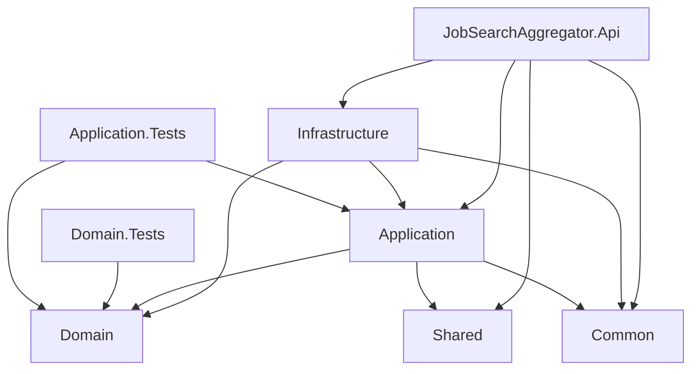

# Job Search Aggregator — Master Project Plan & Tracker

> **Living document.** Update this file at the end of every iteration/phase.
> Read this file first when resuming work in a new session.
> Last updated: **2026-08-03** (Phase 2 code-complete, 14/14 tasks; Phase 3 next)

---

## 1. Project Vision

A **local-only, production-quality AI-powered job search aggregator**. It automatically
discovers jobs from free/public sources (company career pages, Greenhouse, Lever, Ashby,
Workday, SmartRecruiters, SuccessFactors, iCIMS, RSS/public APIs), deduplicates them,
scores them against the user's skills/preferences using a hybrid deterministic + LLM
matching engine, and surfaces everything in a dashboard with email notifications for
high-match roles.

Single user, runs locally (Docker Compose for infra), no cloud hosting required.

---

## 2. Tech Stack

| Layer | Choice |
|---|---|
| Backend | .NET 9, ASP.NET Core Web API, Clean Architecture |
| CQRS/Mediator | MediatR 14.2.0 ⚠️ *(see Open Decisions — commercial license warning)* |
| Validation | FluentValidation 12.1.1 |
| Mapping | Mapster 10.0.11 |
| ORM | EF Core 9.0.1 + Npgsql 9.0.4 (pinned — latest Npgsql 10.x needs net10.0) |
| Database | PostgreSQL 16 (Docker) |
| Cache | Redis 7 (Docker), falls back to in-memory cache if unset |
| Resilience | Polly 8.7.0 |
| Logging | Serilog (Console + rolling daily file, 14-day retention) |
| API Docs | Swashbuckle.AspNetCore 10.2.3 (Swagger UI) |
| Health checks | Microsoft.Extensions.Diagnostics.HealthChecks.EntityFrameworkCore |
| Scheduler (Phase 2) | Quartz.NET or Hangfire — **not yet decided**, see Phase 2 |
| LLM Provider | Anthropic Claude (default), `ILLMService` abstraction for others |
| Frontend | Angular 20 + Angular Material, SCSS, routing, dark/light theme |
| Auth | JWT — **deferred**, not in Phase 1 (single local user) |
| Infra | Docker Compose (Postgres + Redis only; app runs natively, not containerized) |
| Testing | xUnit (Domain.Tests, Application.Tests), Angular default test runner (later) |

---

## 3. Architecture (Clean Architecture, 8 backend projects)

Dependency direction is strictly inward (Domain has zero dependencies).

---

## 4. Agent Responsibility Matrix

Which custom agent to invoke for which kind of work, going forward:

| Work type | Agent to use | When |
|---|---|---|
| High-level system/component design, new subsystem architecture (e.g., Scheduler + Provider engine) | **architecture-agent** | Before writing code for a new phase that introduces new components/communication patterns |
| Business rules, decision logic, state machines, matching/scoring algorithms, edge cases | **logic-design-agent** | Before implementing matching engine (Phase 5), scheduler trigger rules (Phase 2), dedup rules |
| Actual code implementation (backend C#, Angular components, EF migrations, tests) | **coding-agent** | Every phase's implementation step, once design is agreed |
| UI/UX flows, dashboard layout, information architecture, empty/error/loading states | **ui-ux-agent** | Phase 4 (Dashboard) primarily; also Angular shell theming decisions |
| Technology comparisons/tradeoffs (e.g. Quartz vs Hangfire, provider scraping approach) | **tech-stack-agent** | When a new tech decision is needed (Phase 2 scheduler choice, Phase 6 LLM provider fallback) |
| Breaking a phase into buildable tasks / smallest viable slice | **mvp-planner-agent** | Start of each new phase, to sequence sub-tasks |
| Reviewing implementation vs plan for gaps | **completeness-auditor** | End of each phase, before marking it "done" |
| Adversarial testing — edge cases, security holes, race conditions | **testing-critic** | End of each phase, especially Phase 2 (scheduler concurrency), Phase 6 (LLM), Phase 7 (email) |
| Deep research on a specific tricky topic (e.g., anti-bot scraping limits, ATS quirks) | **deep-dive-agent** | When a specific provider integration (Workday, SuccessFactors) proves non-trivial |
| Coordinating multi-phase state / deciding next step across the whole SDLC | **project-orchestrator** | Optional — used sparingly since this plan file + me (main agent) already track state |
| Read-only codebase exploration/Q&A | **Explore** | Any time I need to check "does X already exist" without cluttering main context |

This matrix will be applied explicitly at the start of each phase below (see "Agents used" per phase).

---

## 5. Phase Tracker

Legend: ✅ Done · 🔄 In Progress · ⏳ Not Started · ⚠️ Blocked/Needs Decision

### Phase 1 — Solution Structure, Clean Architecture, Database, Angular Shell
**Status: ✅ 100% complete**
**Agents used:** built directly (backend); `coding-agent` subagent (Angular shell, real tests, `.gitignore`)

| Task | Status | Notes |
|---|---|---|
| 8-project Clean Architecture solution scaffolded | ✅ | Domain, Common, Shared, Application, Infrastructure, Api, Domain.Tests, Application.Tests |
| Domain layer (entities, enums, exceptions) | ✅ | Company, Job, SavedJob, AppliedJob, IgnoredJob, Notification, UserSkill, UserSettings, SchedulerRunHistory, ProviderRunHistory, SystemLogEntry |
| Common layer (Result/Result\<T\>, Guard) | ✅ | |
| Shared layer (ApiResponse\<T\>, PagedResult\<T\>, PagedRequest) | ✅ | |
| Infrastructure (AppDbContext, EF configs, jsonb list conversion, generic Repository, UserSettingsRepository, DI) | ✅ | |
| Application (MediatR + FluentValidation pipeline, Settings CQRS vertical slice) | ✅ | |
| Api (Program.cs: Serilog, Swagger, CORS, health checks, SettingsController) | ✅ | |
| `dotnet build` — 0 warnings, 0 errors | ✅ | Verified 2026-07-31 |
| EF Core `InitialCreate` migration generated | ✅ | |
| Docker Compose (Postgres 16 + Redis 7) | ✅ | Postgres remapped to host port **5433** (native Windows postgres service owns 5432 — see Known Issues) |
| Migration applied to live DB (`dotnet ef database update`) | ✅ | "Done." confirmed |
| API smoke test | ✅ | `GET /health` → Healthy; `GET /api/settings` → 200 with auto-created default row |
| Angular app shell (`ng new`, routing, SCSS) | ✅ | `frontend/` — standalone components, Angular 20 |
| Angular Material added + dark/light theme groundwork | ✅ | Azure-blue M3 theme, `Theme` service toggles `dark-theme` class + persists to `localStorage` |
| `ng build` succeeds | ✅ | 0 errors, initial bundle ~358 kB |
| Domain.Tests: ≥1 real test (no stubs) | ✅ | `NotFoundExceptionTests`, `BaseEntityTests` |
| Application.Tests: ≥1 real test (no stubs) | ✅ | `GetUserSettingsQueryHandlerTests`, `UpdateUserSettingsCommandHandlerTests` (Moq) |
| `.gitignore` for .NET + Angular | ✅ | Repo-root `.gitignore` created |
| README / setup guide | ⏳ | Deferred until Phase 1 fully closes |

**Testing status:** 11 automated tests (Domain.Tests + Application.Tests), all passing via `dotnet test`.

---

### Phase 2 — Scheduler + Provider Architecture
**Status: ✅ Code-complete (14/14 tasks) — pending Phase 3 real providers for genuine end-to-end value**
**Agents used:** `tech-stack-agent` (scheduler engine decision) → `architecture-agent` (design) → `mvp-planner-agent` (14-task sequence) → `coding-agent` (implementation, two sessions)

| Task | Status | Notes |
|---|---|---|
| Decide scheduler engine (Quartz.NET vs Hangfire) | ✅ | Plain `BackgroundService` + `PeriodicTimer` — see `docs/tech-stack.md` |
| Design `IJobProvider` abstraction + provider registry | ✅ | [IJobProvider.cs](src/Application/Providers/IJobProvider.cs), [IJobProviderRegistry.cs](src/Application/Providers/IJobProviderRegistry.cs), [JobProviderRegistry.cs](src/Infrastructure/Providers/JobProviderRegistry.cs) |
| Scheduler run history wiring | ✅ | [RunSchedulerCommand.cs](src/Application/Scheduler/Commands/RunSchedulerCommand.cs), [ProviderRunExecutor.cs](src/Application/Scheduler/Services/ProviderRunExecutor.cs) |
| Retry logic for failed providers (`SchedulerTriggerType.RetryFailedProvider`) | ✅ | [RetryProviderCommand.cs](src/Application/Scheduler/Commands/RetryProviderCommand.cs) — validates `{id}/{providerName}` against an existing Failed/PartialSuccess `ProviderRunHistory` |
| Deduplication logic (`Job.UniqueHash`) | ✅ | [JobHashCalculator.cs](src/Application/Scheduler/Services/JobHashCalculator.cs) |
| Manual trigger + read/retry API endpoints | ✅ | [SchedulerController.cs](src/Api/Controllers/SchedulerController.cs) — 5 endpoints |
| Background scheduler loop | ✅ | [SchedulerBackgroundService.cs](src/Infrastructure/Scheduler/SchedulerBackgroundService.cs) — `PeriodicTimer` raced against `ISchedulerTriggerSignal`, re-reads `SchedulerIntervalHours` each iteration |
| Read queries (list/detail/status) | ✅ | [GetSchedulerRunsQuery.cs](src/Application/Scheduler/Queries/GetSchedulerRunsQuery.cs), [GetSchedulerRunByIdQuery.cs](src/Application/Scheduler/Queries/GetSchedulerRunByIdQuery.cs), [GetSchedulerStatusQuery.cs](src/Application/Scheduler/Queries/GetSchedulerStatusQuery.cs) |
| Unit + integration tests for scheduler/provider core | ✅ | 28 new tests: `JobHashCalculatorTests`, `SchedulerRunGateTests`, `RunSchedulerCommandHandlerTests` (7), `RetryProviderCommandHandlerTests` (6) |

All 14 tasks from `docs/phase2-implementation-tasks.md` implemented across two coding sessions (2026-08-02, 2026-08-03). See Iteration Log below for session 2 details. Genuine end-to-end value (real jobs flowing in) requires Phase 3 providers — currently 0 providers registered, so scheduler runs are no-ops by design.

---

### Phase 3 — Company Providers (Greenhouse, Lever, Ashby, Workday, SmartRecruiters, SuccessFactors, iCIMS, RSS)
**Status: ⏳ Not started**
**Agents to use:** `deep-dive-agent` (per-ATS quirks/rate limits) → `coding-agent` (implement each provider) → `testing-critic`

| Provider | Status |
|---|---|
| Greenhouse | ⏳ |
| Lever | ⏳ |
| Ashby | ⏳ |
| Workday | ⏳ |
| SmartRecruiters | ⏳ |
| SuccessFactors | ⏳ |
| iCIMS | ⏳ |
| RSS/Public API generic provider | ⏳ |
| Company career page generic scraper | ⏳ |

---

### Phase 4 — Dashboard (Angular)
**Status: ⏳ Not started**
**Agents to use:** `ui-ux-agent` (journeys, layout, empty/error states) → `coding-agent` (Angular implementation) → `testing-critic`

| Task | Status |
|---|---|
| Job list/board view with filters | ⏳ |
| Job detail view | ⏳ |
| Save/Apply/Ignore actions | ⏳ |
| Settings screen (bound to existing `/api/settings`) | ⏳ |
| Scheduler run history view | ⏳ |
| Dark/light theme toggle | ⏳ |

---

### Phase 5 — Hybrid Deterministic + LLM Skill Matching
**Status: ⏳ Not started**
**Agents to use:** `logic-design-agent` (scoring rules, thresholds, edge cases) → `coding-agent` → `testing-critic`

| Task | Status |
|---|---|
| Deterministic skill-match scoring algorithm | ⏳ |
| Missing/recommended skills computation | ⏳ |
| Confidence scoring | ⏳ |
| Match score persistence (`Job.DeterministicMatchScore` etc. already modeled) | ⏳ |

---

### Phase 6 — LLM Integration
**Status: ⏳ Not started**
**Agents to use:** `tech-stack-agent` (provider fallback strategy) → `architecture-agent` (`ILLMService` design) → `coding-agent` → `testing-critic` (prompt injection/cost/rate-limit edge cases)

| Task | Status |
|---|---|
| `ILLMService` abstraction | ⏳ |
| Anthropic Claude implementation | ⏳ |
| AI reasoning persistence (`Job.AiReasoning`) | ⏳ |
| Cost/rate-limit guardrails | ⏳ |

---

### Phase 7 — Email Notifications
**Status: ⏳ Not started**
**Agents to use:** `logic-design-agent` (threshold/notification rules) → `coding-agent` → `testing-critic`

| Task | Status |
|---|---|
| Notification entity wiring (already modeled) | ⏳ |
| Email templating | ⏳ |
| Threshold-based trigger (`UserSettings.NotificationThresholdPercent`) | ⏳ |
| Delivery status tracking | ⏳ |

---

### Phase 8 — Analytics
**Status: ⏳ Not started**
**Agents to use:** `ui-ux-agent` (analytics views) → `coding-agent` → `completeness-auditor`

| Task | Status |
|---|---|
| Scheduler run analytics | ⏳ |
| Match score trends | ⏳ |
| Provider success/failure rates | ⏳ |

---

## 6. Overall Progress Snapshot

| Metric | Value |
|---|---|
| Phases fully complete | 1 / 8 (Phase 1) — Phase 2 code-complete but not "done" until Phase 3 providers give it real jobs to process |
| Phases in progress | 0 / 8 |
| Backend build status | ✅ Passing (0 warnings, 0 errors) |
| Automated test count | 39 real tests, all passing (7 Domain.Tests + 32 Application.Tests) |
| Frontend status | App shell built, `ng build` passing |
| API endpoints implemented | 7 (`GET/PUT /api/settings`, `POST /api/scheduler/run`, `POST /api/scheduler/runs/{id}/retry-provider/{providerName}`, `GET /api/scheduler/runs`, `GET /api/scheduler/runs/{id}`, `GET /api/scheduler/status`) |
| Docker services running | Postgres (5433), Redis (6379) — both healthy |
| Frontend dev proxy target | `http://localhost:5071` (backend `http` launch profile) |

---

## 7. Known Issues / Gotchas Log

1. **Port 5432 conflict**: native Windows `postgresql-x64-18` service already binds
   0.0.0.0:5432. Our compose Postgres is remapped to **5433** to avoid silently
   connecting to the wrong database. See `/memories/dotnet-environment.md`.
2. **Corporate NuGet feed 401**: solved via scoped `NuGet.Config` (nuget.org only)
   at solution root.
3. **`dotnet remove` broken** on this machine/path — always edit `.csproj` manually.
4. Terminal sessions occasionally spawn in the wrong working directory or become
   unresponsive — always prefix with explicit `Set-Location` and verify before
   trusting output.

---

## 8. Open Decisions Needing User Input

1. **MediatR licensing** — v14.2.0 requires a paid commercial license for production
   use (free for dev/test only). Options: (a) accept for this local personal tool,
   (b) switch to a free alternative. **Status: unresolved, not blocking Phase 1 close.**
2. **Scheduler engine** — Quartz.NET vs Hangfire for Phase 2. To be settled via
   `tech-stack-agent` at the start of Phase 2.
3. **Auth (JWT)** — explicitly deferred from Phase 1. Need to decide which phase
   introduces it (currently not blocking since app is single-user/local).

---

## 9. Iteration Log

| Date | Iteration summary |
|---|---|
| 2026-07-31 | Phase 1 backend fully scaffolded, built, migrated, and smoke-tested. Docker port-conflict diagnosed and fixed. Created this master plan file. Next: close out Phase 1 (Angular shell + real tests), then begin Phase 2 design. |
| 2026-07-31 | Phase 1 closed out: Angular app shell (`frontend/`) with Material, routing (Dashboard/Settings placeholders), dark/light theme toggle, and dev proxy to `localhost:5071` — `ng build` passes with 0 errors. Replaced stub tests with 11 real tests across Domain.Tests and Application.Tests (Moq-based handler tests) — `dotnet test` all green. Added repo-root `.gitignore`. Final `dotnet build JobSearchAggregator.slnx` passes (0 warnings/errors, 8 projects). **Phase 1 is now 100% complete.** Next: Phase 2 (Scheduler + Provider architecture) design. |
| 2026-08-02 | Phase 2 design: `tech-stack-agent` picked plain `BackgroundService`+`PeriodicTimer` over Quartz/Hangfire; `architecture-agent` designed the full provider/scheduler contract set (`IJobProvider`, `RunSchedulerCommand`/`RetryProviderCommand`, dedup hashing, concurrency gate); `mvp-planner-agent` sequenced it into 14 tasks (`docs/phase2-implementation-tasks.md`). `coding-agent` implemented tasks 1-10: `IJobProvider`/`RawJobListing`, `IJobProviderRegistry`/`JobProviderRegistry`, `FakeJobProvider` test double, `IJobHashCalculator`+tests, `ISchedulerRunGate`+tests, `ISchedulerTriggerSignal`, `SchedulerRunDto`/`ProviderRunDto`, `RunSchedulerCommand`+handler+tests (7), `RetryProviderCommand`+handler (no tests yet). `dotnet build` 0 errors, `dotnet test` 33/33 passing. |
| 2026-08-03 | Phase 2 finished (tasks 11-14): found and fixed a gap in task 10's `RetryProviderCommandHandler` — it wasn't actually validating that `{id}/{providerName}` corresponded to an existing Failed/PartialSuccess `ProviderRunHistory` per the architecture doc §5.6, only that the run existed and the provider was currently enabled; added the missing validation (queries `IRepository<ProviderRunHistory>` directly since `IRepository<T>.GetByIdAsync` doesn't eager-load navigation collections). Added `RetryProviderCommandHandlerTests.cs` (6 tests: valid retry creates new run+1 provider run, `PartialSuccess` also retryable, non-failed provider run rejected, unknown run id rejected, provider-name mismatch rejected, gate-conflict throws) — task 11. Added the 3 scheduler read queries (`GetSchedulerRunsQuery` paged newest-first, `GetSchedulerRunByIdQuery` with nested `ProviderRuns` loaded via a separate batched query, `GetSchedulerStatusQuery` returning a new `SchedulerStatusDto` with `IsRunning`/`LastRunAtUtc`/`NextEstimatedRunAtUtc`) — task 12. Added `SchedulerBackgroundService` (races `PeriodicTimer` against `ISchedulerTriggerSignal`, re-reads `SchedulerIntervalHours` per iteration via a fresh DI scope, sends `RunSchedulerCommand` via `ISender`); registered it with `AddHostedService<SchedulerBackgroundService>()` in `Infrastructure/DependencyInjection.cs` (alongside the gate/signal/registry singletons already registered there) rather than `Program.cs`, for composition-root consistency; required adding a new `Microsoft.Extensions.Hosting.Abstractions` package reference to `Infrastructure.csproj` (needed for `BackgroundService`, which a plain class library doesn't get for free) — task 13. Added `SchedulerController` with all 5 endpoints (`POST /run`, `POST /runs/{id}/retry-provider/{providerName}`, `GET /runs`, `GET /runs/{id}`, `GET /status`), mirroring `SettingsController`'s `ISender`+`ApiResponse<T>` conventions, `409` on `SchedulerRunInProgressException`, `404` on `NotFoundException` — task 14. **Final verification:** `dotnet build JobSearchAggregator.slnx` — 0 warnings/0 errors. `dotnet test` — 39/39 passing (7 Domain.Tests + 32 Application.Tests, up from 33). Live smoke test (API on `localhost:5080`, Docker Postgres/Redis already running): `POST /api/scheduler/run` → 200 with a `Success`-status `SchedulerRunDto` (0 providers, expected pre-Phase-3); `GET /api/scheduler/runs` → 200, paged list containing that run; `GET /api/scheduler/status` → 200, `isRunning: false`. **Phase 2 is now code-complete (14/14 tasks)** — marked as pending full "done" status until Phase 3 gives it real providers to actually exercise end-to-end. Next: Phase 3 (Greenhouse/Lever/Ashby/etc. providers), likely starting with `deep-dive-agent` for ATS-specific quirks. |
