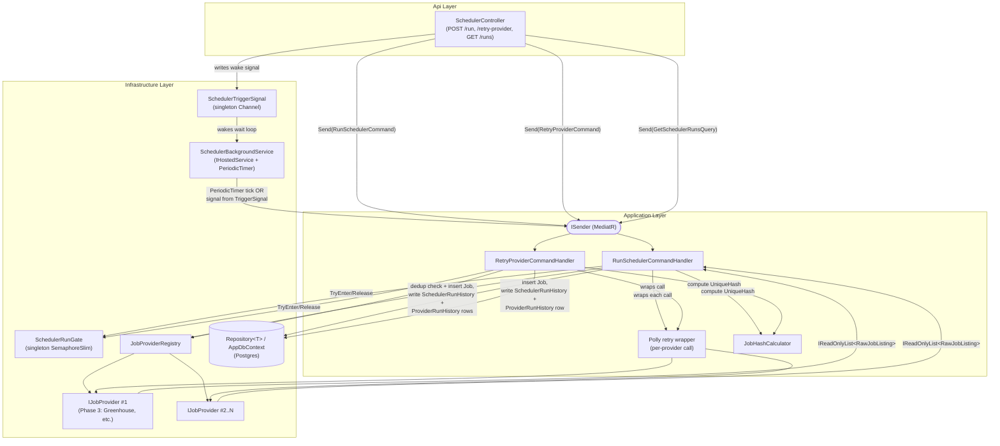

# Phase 2 Architecture — Scheduler & Provider Ingestion Pipeline

> Builds on the tech-stack decision in [tech-stack.md](./tech-stack.md): plain
> `BackgroundService` + `PeriodicTimer` (no Quartz.NET, no Hangfire, no new
> NuGet packages, no new DB tables). Builds on the **existing** Domain entities
> `SchedulerRunHistory`, `ProviderRunHistory`, `Job`, `UserSettings` and their
> enums (`SchedulerRunStatus`, `ProviderRunStatus`, `SchedulerTriggerType`,
> `JobSourceType`) exactly as already modeled — this document does not
> redesign them. See §8 for the one point where a Domain change was
> considered and rejected.

---

## 1. System Overview

Phase 2 adds a self-contained **ingestion orchestration subsystem** on top of
the Phase 1 Clean Architecture skeleton. A single `BackgroundService`
(Infrastructure layer) wakes up on a timer — interval read live from
`UserSettings.SchedulerIntervalHours` — or on-demand from an API call, and in
both cases dispatches the **same** MediatR command (`RunSchedulerCommand`)
that does all the real work: iterate enabled `IJobProvider`s (Phase 3 will
supply real ones; Phase 2 only defines the contract), fetch raw job listings,
deduplicate against existing `Job` rows via `UniqueHash`, persist new jobs,
and record everything in `SchedulerRunHistory` / `ProviderRunHistory`. A
parallel `RetryProviderCommand` re-runs a single provider outside the normal
cadence.

**Key design decisions** (justified in detail in later sections):

- **Sequential provider execution**, not parallel — politeness to scraped
  external sites, simpler dedup reasoning, unambiguous per-provider failure
  attribution.
- **One in-process concurrency gate** (`ISchedulerRunGate`, a `SemaphoreSlim`)
  prevents the timer and a manual trigger from ever running concurrently —
  sufficient because this is single-process/single-node.
- **Retry-single-provider creates a *new* `SchedulerRunHistory` row** (not an
  attach-to-existing-run), because `SchedulerTriggerType.RetryFailedProvider`
  is a value on `SchedulerRunHistory.TriggerType`, not on
  `ProviderRunHistory` — the existing enum placement already implies every
  triggered operation (full batch or single retry) gets its own top-level
  history row. See §3.4 for the full reasoning.
- **Dedup happens via a pre-insert existence check per provider batch**, with
  the existing unique index on `Job.UniqueHash` kept as a defensive
  constraint-violation fallback — not the primary mechanism.
- **No new Domain entities or fields are required.** Everything Phase 2 needs
  is already present.

---

## 2. Component Breakdown

| Component | Layer | Responsibility |
|---|---|---|
| `SchedulerBackgroundService` | Infrastructure | Hosted service; owns the `PeriodicTimer`; on each tick or wake signal, creates a DI scope and sends `RunSchedulerCommand` via `ISender`. Contains **no business logic**. |
| `ISchedulerTriggerSignal` / `SchedulerTriggerSignal` | Application (interface) / Infrastructure (impl) | Singleton wrapper around a `Channel<SchedulerTriggerType>` (or `SemaphoreSlim`) that the manual-trigger API endpoint writes to, and the background service's wait loop reads from, to wake immediately instead of waiting for the next timer tick. |
| `ISchedulerRunGate` / `SchedulerRunGate` | Application (interface) / Infrastructure (impl) | Singleton in-process mutual-exclusion gate (`SemaphoreSlim(1,1)`) — `TryEnter()` / `Release()` — ensures only one run (automatic or manual) executes at a time. |
| `RunSchedulerCommand` + Handler | Application (`Scheduler/Commands`) | The full orchestration pipeline: create `SchedulerRunHistory`, resolve enabled `IJobProvider`s, invoke each sequentially through Polly, map+dedup+persist `Job` rows, create/update `ProviderRunHistory` rows, finalize `SchedulerRunHistory`. |
| `RetryProviderCommand` + Handler | Application (`Scheduler/Commands`) | Same pipeline scoped to exactly one named provider; always creates a new `SchedulerRunHistory` (`TriggerType = RetryFailedProvider`) + one `ProviderRunHistory`. |
| `IJobProvider` | Application (`Providers`) | Contract every Phase 3 concrete provider implements. Returns raw, unmapped job data (`RawJobListing`). |
| `IJobProviderRegistry` / `JobProviderRegistry` | Application (interface) / Infrastructure (impl) | Resolves the set of registered `IJobProvider`s (via DI collection) filtered down to those enabled in `UserSettings.EnabledProviders`. |
| `RawJobListing` | Application (`Providers`) | Intermediate DTO — provider output before mapping to the `Job` entity. |
| `IJobHashCalculator` / `JobHashCalculator` | Application (`Scheduler/Services`) | Pure, unit-testable function computing `Job.UniqueHash` from normalized company+title+location+source+applyUrl. |
| Polly resilience pipeline | Application (built inline in the handler, using the already-installed Polly package) | Wraps each `IJobProvider.FetchJobsAsync()` call with retry + backoff; failure after retries exhausted marks that provider `Failed` without aborting the whole run. |
| `IRepository<Job>`, `IRepository<Company>`, `IRepository<SchedulerRunHistory>`, `IRepository<ProviderRunHistory>`, `IUnitOfWork` | Application interfaces / Infrastructure (`Repository<T>`) | Existing generic repository + unit-of-work abstractions — reused as-is, no new repository types needed. |
| `SchedulerController` | Api | `POST /api/scheduler/run`, `POST /api/scheduler/runs/{id}/retry-provider/{providerName}`, `GET /api/scheduler/runs`, `GET /api/scheduler/runs/{id}`, `GET /api/scheduler/status` — thin, `ISender`-based, same `ApiResponse<T>` envelope as `SettingsController`. |

---

## 3. Architecture Diagram (Textual)



---

## 4. `IJobProvider` Contract

### 4.1 Interface

```
namespace JobSearchAggregator.Application.Providers;

public interface IJobProvider
{
    /// Stable identifier used for UserSettings.EnabledProviders matching,
    /// ProviderRunHistory.ProviderName, and logging. Convention: matches the
    /// JobSourceType enum member name exactly (e.g. "Greenhouse").
    string ProviderName { get; }

    /// Which JobSourceType this provider's output should be tagged with.
    JobSourceType SourceType { get; }

    /// Fetches all currently-available job listings from this source.
    /// Must NOT throw for "zero results" (return an empty list) — only
    /// throw for genuine failures (network error, non-2xx response,
    /// unexpected schema), which the orchestrator's Polly wrapper will
    /// retry and, on exhaustion, record as a Failed ProviderRunHistory.
    Task<IReadOnlyList<RawJobListing>> FetchJobsAsync(CancellationToken cancellationToken);
}
```

Rationale for a single method: providers are pure "fetch everything currently
listed" data sources — there's no pagination/incremental-sync state to expose
at this layer in Phase 2 (individual providers can paginate internally before
returning the full list). Keeping the contract to one method keeps Phase 3
implementations simple and keeps the orchestrator provider-agnostic.

### 4.2 `RawJobListing` DTO

Providers do not know about `Job.Id`, `Job.UniqueHash`, `Job.CompanyId`
(a real FK to a persisted `Company` row), or any matching-engine fields —
those are populated by the orchestrator, not the provider. `RawJobListing` is
the provider's raw, source-shaped output:

```
namespace JobSearchAggregator.Application.Providers;

public sealed class RawJobListing
{
    public required string CompanyName { get; init; }
    public string? CompanyCareerUrl { get; init; }
    public required string Title { get; init; }
    public required string Location { get; init; }
    public WorkMode WorkMode { get; init; } = WorkMode.Unspecified;
    public decimal? SalaryMin { get; init; }
    public decimal? SalaryMax { get; init; }
    public string? SalaryCurrency { get; init; }
    public int? ExperienceMinYears { get; init; }
    public int? ExperienceMaxYears { get; init; }
    public EmploymentType EmploymentType { get; init; } = EmploymentType.FullTime;
    public string? Department { get; init; }
    public List<string> RequiredSkills { get; init; } = new();
    public List<string> PreferredSkills { get; init; } = new();
    public required string Description { get; init; }
    public List<string> Responsibilities { get; init; } = new();
    public List<string> Benefits { get; init; } = new();
    public required string ApplyUrl { get; init; }
    public required string ExternalId { get; init; }
    public DateTime PostedAtUtc { get; init; }
}
```

`Source` and `SourceName` on the eventual `Job` entity are filled in by the
orchestrator from the provider's own `SourceType`/`ProviderName` — the DTO
doesn't need to repeat them.

### 4.3 `JobSourceType` → provider mapping

- Each concrete provider declares its own fixed `SourceType` (e.g.
  `GreenhouseProvider.SourceType => JobSourceType.Greenhouse`).
- `IJobProviderRegistry.GetEnabledProviders()` resolves the DI-registered
  `IEnumerable<IJobProvider>` collection and filters it down to providers
  whose `ProviderName` (== `JobSourceType` enum member name, by convention)
  appears in `UserSettings.EnabledProviders`.
- Unknown/misspelled strings in `EnabledProviders` are **ignored with a
  logged warning**, not a hard failure — keeps the run resilient to stale
  settings after a provider is renamed/removed.
- Phase 2 ships **no production provider registrations**. A `FakeJobProvider`
  test double (configurable to return canned data, throw, or fail N times
  then succeed) lives under `tests/Application.Tests/Scheduler/Fakes/` for
  handler unit tests — it is **not** registered in the production DI
  container, avoiding any need to invent a placeholder `JobSourceType` value.

---

## 5. Orchestration Flow (the "run" pipeline)

### 5.1 Run start

Three entry points, one pipeline:

1. **Automatic** — `SchedulerBackgroundService`'s `PeriodicTimer` ticks (period
   re-read from `UserSettings.SchedulerIntervalHours` at the start of every
   loop iteration, so a settings change takes effect on the *next* tick
   without restarting the service). Sends `RunSchedulerCommand { Trigger =
   SchedulerTriggerType.Automatic }`.
2. **Manual** — `POST /api/scheduler/run` → `SchedulerController` sends
   `RunSchedulerCommand { Trigger = SchedulerTriggerType.Manual }` directly
   via `ISender`, **and** also signals `ISchedulerTriggerSignal` so a
   concurrently-idle background loop wakes immediately for its *next*
   scheduled cycle bookkeeping (mainly relevant if/when the wait loop itself
   needs to reset its timer window after a manual run — see §5.6).
3. **Retry one provider** — `POST /api/scheduler/runs/{id}/retry-provider/{providerName}`
   → sends `RetryProviderCommand { OriginalRunId = id, ProviderName = providerName }`.

### 5.2 `SchedulerRunHistory` lifecycle (full run)

1. Handler calls `ISchedulerRunGate.TryEnter()`. If it returns `false` (a run
   is already in progress):
   - Automatic trigger: log and return early, no history row created (there's
     nothing meaningfully new to report — the in-flight run will produce one).
   - Manual/API trigger: return a failure result the controller turns into
     `409 Conflict` + `ApiResponse.Fail("A scheduler run is already in progress.")`.
2. On successful entry, create and persist a `SchedulerRunHistory` row
   immediately: `StartedAtUtc = UtcNow`, `TriggerType` as passed in,
   `Status = Running`. Save immediately (not batched with the rest) so the
   run is visible to `GET /api/scheduler/runs` while still executing.
3. Resolve enabled providers via `IJobProviderRegistry`.
4. For each provider **sequentially** (see §5.3 for why): run the
   per-provider sub-pipeline (§5.4), accumulating totals.
5. After all providers processed, finalize the `SchedulerRunHistory`:
   `FinishedAtUtc = UtcNow`, `TotalProvidersRun`, `TotalJobsFound`,
   `TotalJobsAdded` set from accumulated counters, and:
   - `Status = Success` if every provider succeeded,
   - `Status = PartialSuccess` if at least one succeeded and at least one failed,
   - `Status = Failed` if every provider failed (or zero providers were enabled/resolved — treated as a failed/no-op run with `ErrorMessage = "No enabled providers."`).
6. `finally` block releases `ISchedulerRunGate` regardless of outcome
   (including on unhandled exceptions — wrap the whole per-provider loop in
   a try/catch that still finalizes the `SchedulerRunHistory` as `Failed`
   with the exception message before releasing the gate, so a run can never
   get "stuck" leaving the gate held).

### 5.3 Sequential vs. parallel provider execution — **recommend sequential**

Justification:
- **Politeness / rate-limiting**: providers are hitting external ATS APIs and
  company career pages that are not ours to control; running them one at a
  time avoids an accidental self-inflicted burst that looks like abusive
  traffic across multiple hosts simultaneously (and makes any future
  per-host rate limiting trivial to add — just a delay between iterations).
- **Simpler dedup reasoning**: with sequential execution and a per-provider
  `SaveChanges`, provider *N*'s dedup check can see everything provider
  *N-1* already committed in the *same run*, using a plain DB query — no
  need for in-memory cross-task coordination.
- **Unambiguous failure/retry attribution**: `ProviderRunHistory.RetryCount`
  and timing (`DurationMs`) stay meaningful per provider without shared
  resource contention skewing them.
- **Cost of sequential is acceptable now**: provider count is small (Phase 3
  starts with a handful), and this runs on an interval (hours), not something
  latency-sensitive. If wall-clock time becomes a real problem after more
  providers are added, bounded parallelism (e.g. `SemaphoreSlim(3)`) can be
  introduced later inside `RunSchedulerCommandHandler` without changing the
  `IJobProvider` contract, the entities, or the API.

### 5.4 Per-provider sub-pipeline

For each enabled provider, in order:

1. Create a `ProviderRunHistory` row: `ProviderName`, `SchedulerRunHistoryId`
   set to the current run's Id, `StartedAtUtc = UtcNow`, `Status = Running`.
   Persist immediately (same reasoning as §5.2 step 2 — visible mid-run).
2. Invoke `provider.FetchJobsAsync(cancellationToken)` wrapped in a Polly
   retry policy (see §5.5). Track the number of retry attempts Polly
   actually used via its `onRetry` callback → `ProviderRunHistory.RetryCount`.
3. **On success**: for each returned `RawJobListing`, run it through the
   map-and-dedup step (§6) to persist new `Job` rows. Set
   `ProviderRunHistory.JobsFound = <count returned>`,
   `JobsAdded = <count actually inserted, post-dedup>`,
   `Status = Success`, `FinishedAtUtc = UtcNow`,
   `DurationMs = (FinishedAtUtc - StartedAtUtc).TotalMilliseconds`.
4. **On failure** (Polly's retries exhausted): set `Status = Failed`,
   `ErrorMessage = <exception message, truncated>`, `FinishedAtUtc = UtcNow`,
   `DurationMs` set. **Do not rethrow** — catch at this level so one
   provider's failure never aborts the rest of the run. Log the exception
   with full detail via Serilog; only the message is stored on the entity.
5. Accumulate this provider's `JobsFound`/`JobsAdded` into the parent
   `SchedulerRunHistory`'s running totals (updated once at the end, per §5.2
   step 5, to avoid an extra write per provider).

### 5.5 Polly wrapping

- Policy: retry with exponential backoff + jitter, e.g. 3 attempts,
  base delay 2s (`Polly.Retry` / `Backoff.DecorrelatedJitterBackoffV2`),
  applied around `provider.FetchJobsAsync(...)` only — not around the
  DB-write steps (those are local and should fail fast/loud, not be retried
  transparently, since EF Core's own Npgsql retry-on-failure already covers
  transient DB errors per the existing `EnableRetryOnFailure(3)` in
  `Infrastructure/DependencyInjection.cs`).
- Built once (e.g. a small `IJobProviderResiliencePolicyFactory` or just an
  inline `Policy.Handle<Exception>().WaitAndRetryAsync(...)` built in the
  handler) — not a new persistent registry, since Phase 2 needs exactly one
  policy shape for exactly one call site type.

### 5.6 Retry-single-provider flow — **new `SchedulerRunHistory` row, not attach-to-existing**

Inspected: `ProviderRunHistory.SchedulerRunHistoryId` is `Guid?` (nullable),
and `SchedulerConfigurations.cs` configures the FK as a standard optional
one-to-many with cascade delete. Nullability alone is ambiguous, but a second,
decisive fact resolves it: **`SchedulerTriggerType.RetryFailedProvider` is a
value on `SchedulerRunHistory.TriggerType`**, not on `ProviderRunHistory`.
A trigger-type field only makes sense on an entity that is *always created*
for every triggering event — which means the intended design is:

- A single-provider retry **always creates a brand-new `SchedulerRunHistory`**
  row: `TriggerType = RetryFailedProvider`, `TotalProvidersRun = 1`, and
  exactly one child `ProviderRunHistory` attached via the FK to *this new*
  run, not the original failed run.
- The `{id}` in `POST /api/scheduler/runs/{id}/retry-provider/{providerName}`
  is used only for **validation context**: the handler loads
  `SchedulerRunHistory` `id` and confirms a `ProviderRunHistory` row exists
  under it with `ProviderName == providerName` and `Status == Failed` (or
  `PartialSuccess`) — returning a validation error otherwise (can't "retry" a
  provider that didn't fail, or a run that doesn't exist). It does **not**
  reuse `id` as the FK target for the new `ProviderRunHistory` row.
- This keeps `SchedulerRunHistory` as a uniform, single feed of "every
  scheduler-level operation that ever ran" for the Phase 4 dashboard — a
  retry is just a run with one provider in it, not a special second concept.
- `ISchedulerRunGate` is acquired for retries exactly the same way as full
  runs — a retry cannot run concurrently with a full run or another retry.

---

## 6. Deduplication Logic

### 6.1 `Job.UniqueHash` computation

Per the existing XML doc comment on `Job.UniqueHash` ("Deterministic hash of
Company + Title + Location + Source + ApplyUrl"), computed by
`IJobHashCalculator` as a pure function:

1. Resolve the `Company` name (from `RawJobListing.CompanyName`, after
   find-or-create-by-normalized-name against the `Companies` table — this is
   ordinary application logic, not a Domain change).
2. Build a normalized composite key from five fields, in this order:
   `CompanyName`, `Title`, `Location`, `Source` (the `JobSourceType` enum
   name), `ApplyUrl`.
3. Normalize each field independently before concatenation:
   - Trim leading/trailing whitespace.
   - Collapse internal whitespace runs to a single space.
   - Lowercase (invariant culture).
   - For `ApplyUrl` specifically: also strip a trailing `/` and any query
     string (`?...`) — the same posting is frequently re-linked with
     different tracking query params by different scrapes of the same
     source.
4. Join the five normalized fields with a delimiter that cannot appear in any
   of them (e.g. `"\u001F"`, the ASCII unit-separator control character).
5. Compute `SHA256` over the UTF-8 bytes of the joined string; hex-encode the
   32-byte digest → a fixed 64-character lowercase hex string. This fits
   comfortably inside the existing `HasMaxLength(128)` column constraint,
   leaving headroom.

This is a **pure function of its five inputs** — no I/O, no randomness —
making it trivially unit-testable (see §8).

### 6.2 Where dedup happens in the pipeline

Recommended: **pre-insert existence check, per provider batch, with the
existing unique index as a defensive fallback** — not "insert then handle
constraint violation" as the primary path, and not a single giant
end-of-run dedup pass.

Concretely, inside step 3 of §5.4 (mapping a provider's `RawJobListing`s):

1. Compute `UniqueHash` for every listing returned by this provider (in
   memory, cheap).
2. Issue **one** query: `SELECT UniqueHash FROM Jobs WHERE UniqueHash IN
   (<computed hashes>)` (via `IRepository<Job>.ListAsync(predicate)` or a
   small dedicated method) to get the set of hashes that already exist.
3. For each listing whose hash is **not** in that set: resolve/create its
   `Company`, map to a new `Job` entity, add it, and track it as "added."
   For listings whose hash **is** in that set: skip (increment a
   "duplicate" counter for logging, but it does not count against
   `JobsAdded`).
4. `SaveChangesAsync()` once per provider (not once per job) — this is also
   what makes cross-provider, same-run dedup work correctly under sequential
   execution: provider *N+1*'s existence-check query will see rows provider
   *N* already committed.
5. **Defensive fallback**: wrap the per-provider `SaveChangesAsync()` in a
   catch for `DbUpdateException` specifically attributable to the
   `UniqueHash` unique index (Npgsql `23505` unique-violation). If hit
   (only possible if this design is later parallelized, or a hash collision
   slips through the pre-check due to a race that shouldn't occur in the
   current sequential/gated design), log it as a duplicate-skip rather than
   failing the whole provider run, and retry the `SaveChangesAsync()` after
   removing the offending entity from the change tracker.

This ordering (check-before-insert as the common path, constraint-as-safety-net)
avoids relying on exceptions for routine control flow while still being
correct if the concurrency model ever changes.

---

## 7. Concurrency & Safety

- **Single in-process gate**: `ISchedulerRunGate` wraps one
  `SemaphoreSlim(1, 1)` registered as a **singleton** (not scoped) in
  Infrastructure DI. `RunSchedulerCommandHandler` and
  `RetryProviderCommandHandler` both call `TryEnter()` (a non-blocking
  `WaitAsync(0)`) at the very start and `Release()` in a `finally`. No
  distributed lock is needed — this is explicitly single-node per
  `docs/tech-stack.md`.
- **Timer tick during an in-flight manual run**: `TryEnter()` returns
  `false`; the automatic path logs
  `"Skipped scheduled run — a run is already in progress."` and returns
  without creating a `SchedulerRunHistory` row for the skipped tick (nothing
  useful to record — the in-flight run already has its own row). The next
  tick fires normally per the `PeriodicTimer`'s cadence.
- **Manual trigger during an in-flight run**: `SchedulerController` gets back
  a failure from the handler and returns `409 Conflict` with
  `ApiResponse<T>.Fail("A scheduler run is already in progress.")` —
  surfaced directly to the (eventual Phase 4) dashboard's "Run Now" button.
- **Retry during an in-flight run**: same `409` behavior via the shared gate
  — a retry is just another gated run.
- **Crash/restart mid-run**: since there's no durable lock (by design — see
  tech-stack.md §"no need to survive a crash mid-job"), a process restart
  simply drops the in-memory semaphore state. Any `SchedulerRunHistory` row
  left in `Status = Running` from before the crash is a visible artifact,
  not a blocker — Phase 2 does **not** attempt automatic reconciliation of
  stale `Running` rows on startup (out of scope; flagged as a possible small
  Phase 4 dashboard nicety — "mark runs stuck in Running for >X hours as
  Failed" — but not required for Phase 2 correctness since a fresh run isn't
  blocked by a stale row).

---

## 8. Where New Code Lives

```
src/Application/
  Providers/
    IJobProvider.cs
    IJobProviderRegistry.cs
    RawJobListing.cs
  Scheduler/
    Commands/
      RunSchedulerCommand.cs           (command + handler, same file convention as Settings)
      RetryProviderCommand.cs          (command + handler)
    Queries/
      GetSchedulerRunsQuery.cs         (paged list for GET /api/scheduler/runs)
      GetSchedulerRunByIdQuery.cs      (detail for GET /api/scheduler/runs/{id})
      GetSchedulerStatusQuery.cs       (GET /api/scheduler/status — IsRunning + next-tick estimate)
    Services/
      IJobHashCalculator.cs / JobHashCalculator.cs
      ISchedulerRunGate.cs             (interface only — impl in Infrastructure)
      ISchedulerTriggerSignal.cs       (interface only — impl in Infrastructure)
    SchedulerRunDto.cs
    ProviderRunDto.cs

src/Infrastructure/
  Scheduler/
    SchedulerBackgroundService.cs
    SchedulerRunGate.cs               (singleton impl of ISchedulerRunGate)
    SchedulerTriggerSignal.cs         (singleton impl of ISchedulerTriggerSignal, Channel-based)
  Providers/
    JobProviderRegistry.cs            (impl of IJobProviderRegistry)
    (Phase 3 adds concrete providers here, e.g. Greenhouse/GreenhouseProvider.cs)

src/Api/
  Controllers/
    SchedulerController.cs

tests/Application.Tests/
  Scheduler/
    Fakes/
      FakeJobProvider.cs
    JobHashCalculatorTests.cs
    RunSchedulerCommandHandlerTests.cs
    RetryProviderCommandHandlerTests.cs
    SchedulerRunGateTests.cs
```

This mirrors the existing `Settings/` vertical-slice convention (command +
handler in one file, DTOs alongside, no separate "Services" folder proliferation
beyond what's needed) and keeps the Infrastructure additions parallel to how
`Persistence/` is organized today.

**Domain change consideration (flagged, not applied)**: none is required.
Everything Phase 2 needs — `SchedulerRunHistory`, `ProviderRunHistory`
(including its nullable FK), the four enums, `Job.UniqueHash`, and
`UserSettings.EnabledProviders`/`SchedulerIntervalHours` — already exists in
the shape needed. The only thing considered and explicitly **rejected** was
adding a `JobSourceType.NoOp`/`Test` enum value to support a test provider;
instead, the test double (`FakeJobProvider`) lives entirely in the test
project and is never registered in production DI, so no enum change is
needed at all.

---

## 9. New API Endpoints

All follow the existing `SettingsController` conventions: constructor-injected
`ISender`, `[ApiController]`/`[Route("api/[controller]")]`, responses wrapped
in `ApiResponse<T>` (or `PagedResult<T>` inside `ApiResponse<T>` for lists).

| Endpoint | Command/Query | Notes |
|---|---|---|
| `POST /api/scheduler/run` | `RunSchedulerCommand { Trigger = Manual }` | `200 OK` + `ApiResponse<SchedulerRunDto>` on accept; `409 Conflict` + `ApiResponse.Fail(...)` if a run is already in progress. |
| `POST /api/scheduler/runs/{id}/retry-provider/{providerName}` | `RetryProviderCommand { OriginalRunId = id, ProviderName = providerName }` | `200 OK` + new `SchedulerRunDto`; `404` if `id` or `providerName` combination doesn't correspond to a failed `ProviderRunHistory`; `409` if a run is in progress. |
| `GET /api/scheduler/runs?page=&pageSize=` | `GetSchedulerRunsQuery` | `ApiResponse<PagedResult<SchedulerRunDto>>`, newest first (`StartedAtUtc DESC`), reusing the existing `PagedRequest`/`PagedResult<T>` shape from Shared. |
| `GET /api/scheduler/runs/{id}` | `GetSchedulerRunByIdQuery` | `ApiResponse<SchedulerRunDto>` including nested `ProviderRuns`; `404` if not found. |
| `GET /api/scheduler/status` | `GetSchedulerStatusQuery` | `ApiResponse<SchedulerStatusDto>` — `IsRunning: bool`, `LastRunAtUtc`, `NextEstimatedRunAtUtc` (best-effort, computed from last automatic run's `StartedAtUtc` + current `SchedulerIntervalHours`) — used by the Phase 4 dashboard to disable "Run Now" while a run is active. |

No authentication middleware is added — consistent with Phase 1's deferred-auth
decision (single local user).

---

## 10. Testing Strategy

### 10.1 Fully unit-testable (no timer, no real DB, no network)

- **`JobHashCalculator`**: pure function — assert identical hashes for
  inputs differing only in case/whitespace/trailing-slash/query-string;
  assert different hashes when any of the five semantic fields differ.
- **`RunSchedulerCommandHandler`**: mock `IJobProviderRegistry` to return a
  list of `FakeJobProvider`s configured to: (a) return N listings
  successfully, (b) throw every time (exhausts Polly, ends `Failed`), (c)
  throw twice then succeed (exercises `RetryCount`), (d) return a listing
  whose computed hash collides with another fake provider's listing in the
  same run (exercises cross-provider dedup). Mock `IRepository<Job>`,
  `IRepository<Company>`, `IUnitOfWork`, and a real (in-memory, trivial)
  `SchedulerRunGate` instance. Assert: correct `SchedulerRunHistory.Status`
  transitions (`Success`/`PartialSuccess`/`Failed`), correct
  `TotalJobsFound`/`TotalJobsAdded`, correct per-provider
  `ProviderRunHistory` rows and `RetryCount`.
- **`RetryProviderCommandHandler`**: mock a single provider; assert a *new*
  `SchedulerRunHistory` is created with `TriggerType = RetryFailedProvider`
  and exactly one child `ProviderRunHistory`; assert `404`/validation
  failure when the referenced `{id}`/`providerName` doesn't correspond to an
  existing failed `ProviderRunHistory`.
- **`SchedulerRunGate`**: `TryEnter()` returns `true` then `false` while held;
  returns `true` again after `Release()`.

### 10.2 Inherently harder to test — `SchedulerBackgroundService` itself

The hosted service should be intentionally "dumb": create a scope, read
`SchedulerIntervalHours`, await `PeriodicTimer.WaitForNextTickAsync()` or the
trigger-signal channel (whichever completes first), send
`RunSchedulerCommand` via `ISender`, loop. Because virtually all of the
actual logic already lives in `RunSchedulerCommandHandler` (fully covered by
§10.1), the background service itself carries very little untested risk.

- Not required, but if desired: a lightweight test can new-up the real
  `SchedulerBackgroundService` with a mocked `ISender`/`IServiceScopeFactory`
  and an artificially short interval, call `StartAsync`/`StopAsync` directly
  (bypassing the generic host), and assert `ISender.Send<RunSchedulerCommand>`
  was invoked at least once within a short timeout. This is optional
  "nice-to-have" coverage, not load-bearing for confidence in correctness —
  the timer/loop plumbing itself is a well-understood BCL primitive with
  no custom branching logic worth asserting on in isolation.

---

## Summary of Constraints Honored

- No new NuGet packages (Polly already installed and unused; now used).
- No new Postgres tables/columns — verified against the actual entities and
  EF configurations, not assumed.
- No Domain entity/enum shape changes.
- Timer, manual trigger, and retry-one-provider all funnel through the same
  two MediatR handlers — one orchestration path, three entry points, per the
  tech-stack decision.
